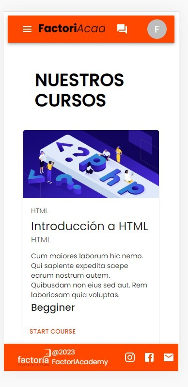
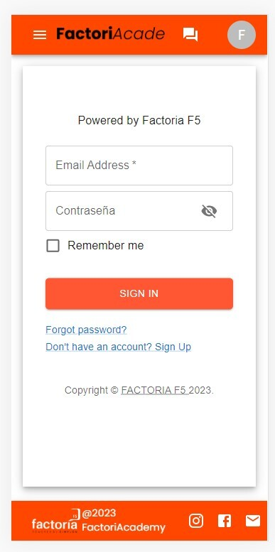
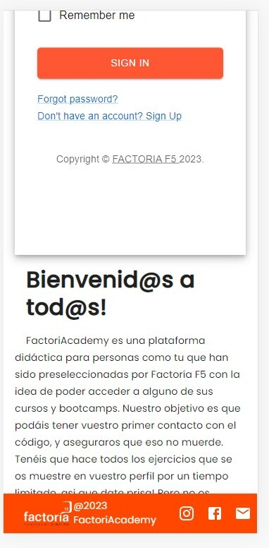
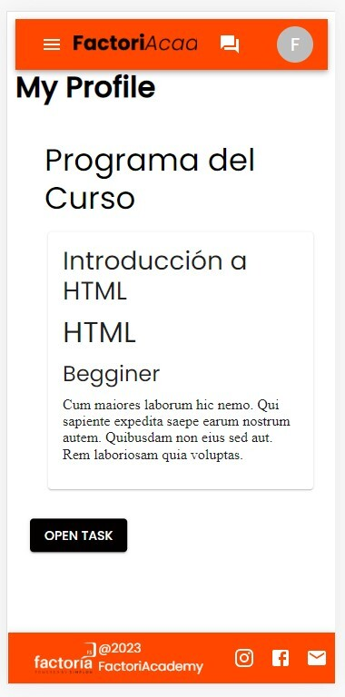
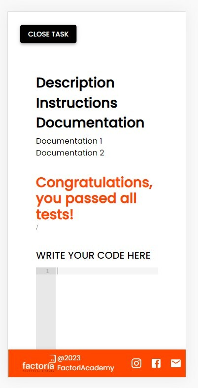
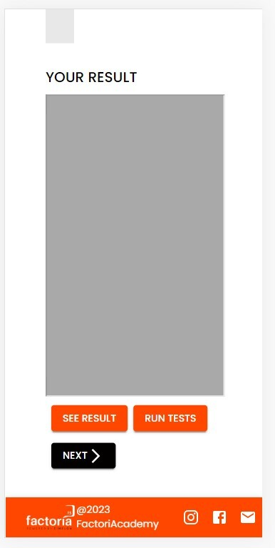
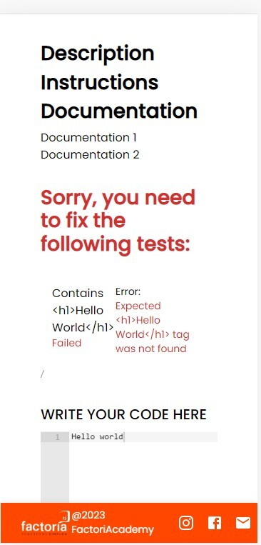

<div align="center"></div>

----

## Table of contents
* [General Information](#general-information)
* [Team Members](#team-members)
* [Screenshots](#screenshots)
* [Technologies](#technologies)
    * [Backend Technologies](#backend-technologies)
    * [Frontend Technologies](#frontend-technologies)
* [Installation](#how-to-install-this-project)
* [Tools](#tools)
* [Methodology](#methodology)


***
## General Information

## <div align="center"> FactoriAcademy es una plataforma didáctica para personas como tu que han sido preseleccionadas por Factoría F5 con la idea de poder acceder a alguno de sus cursos y bootcamps. </div>

Our project aims to allow applicants to have their first contact with the code. It makes it easier for teachers and administrators to take control over the learning process of users.

***


## Team Members

| Name | Role |  |
| :---: | :---: | :---: |
| Judit Calvet |  Scrum Master | https://github.com/Judit-Calvet |
| Matt Sandoval | Product Owner| https://github.com/mattsandovalb |
| Oksana Fedyukova | Developer | https://github.com/OksanaFedyukova |
| Eduard Torres | Developer | https://github.com/Elfin2 |
| Mario Centurión | Developer | https://github.com/Mariovalcen |

***

## Screenshots

<table>
<tr>
<td></td>
<td></td>
<td></td>
<td></td>
</tr>
<tr>
<td></td>
<td></td>
<td></td>
<td></td>
</tr>
<tr>
<td></td>
<td></td>
<td></td>
<td></td>
</tr>
</table>


***

## Technologies

The project was developed with the following technologies

### Backend Technologies

- Laravel Framework
- MySQL
- JWT
- Spatie
- Postman

### Frontend Technologies

- HTML 5
- MaterialUi
- React JS
- ACE
- Sweetalert
- React-router-dom
- Axios
***

### For the chat

- This is the chat repository that was used for this project https://github.com/Mariovalcen/Chat-Factoria

***

## How to install this project

You will need a text editor and perform the following steps:

1. Clone the project, frontend and backend
```bash
  https://github.com/mattsandovalb/FactoriAcademy-client.git
```
```bash
  https://github.com/mattsandovalb/FactoriAcademy-server.git
```

2. Go to the project directory
```bash
  cd FactoriAcademy-client
```
```bash
  cd FactoriAcademy-server
```

3. Start MySQL service and create a MySQL database named "factoriacademy"

4. Create in the text editor an .env file by copying the contents of .env.example and modify the database name to
"factoriacademy"

5. Install dependencies
```bash
  npm install
```
```bash
  composer install
```

6. Activate the server and keep this terminal open
```bash
  npm run dev
```

7. Run the PHP server and keep this terminal open
```bash
  php artisan serve
```

8. Migrate database
```bash
  php artisan migrate:fresh --seed
```

***

***
## Tools

- Figma
- Jira
- GitHub

## Methodology
- Agile with SCRUM
- Pair and solo programming
***
